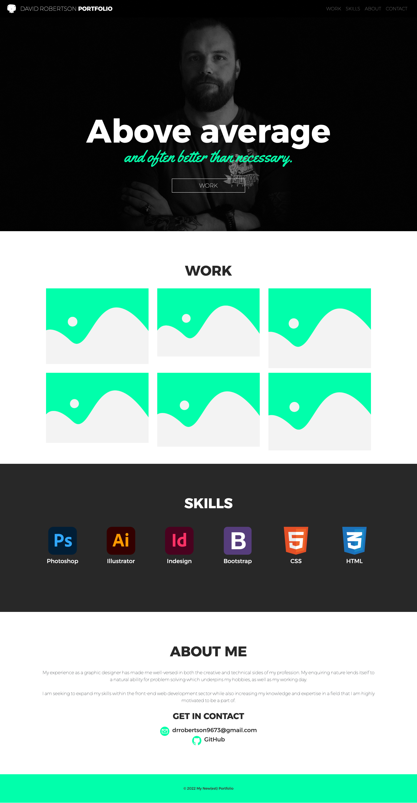
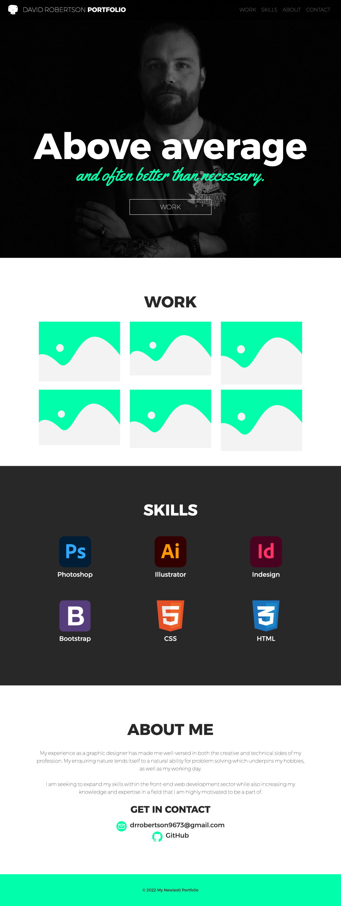

# Bootstrap-Portfolio

## Description
The aim of this project was to rebuild my prvious portfolio using the Bootstrap CSS framework.

The website needed to include a navigation menu at the top with links that are applicable to my portfolio and navigate to the appropriate sections, a hero section featuring my picture and name, a work section displaying work in a grid using Bootstrap cards for each project, and about/contact section, a footer section and all hyerlinks needed to have a hover effect and all buttons should display a box shadow on hover.

## Installation

N/A

## Usage

The website can be accessed via an internet browser and you can navigate to different sections by clicking the links on the right of the navigation bar at the top of the page.

Link: https://drrobertson9673.github.io/Bootstrap-Portfolio/

## Credits

N/A

## License

MIT licence